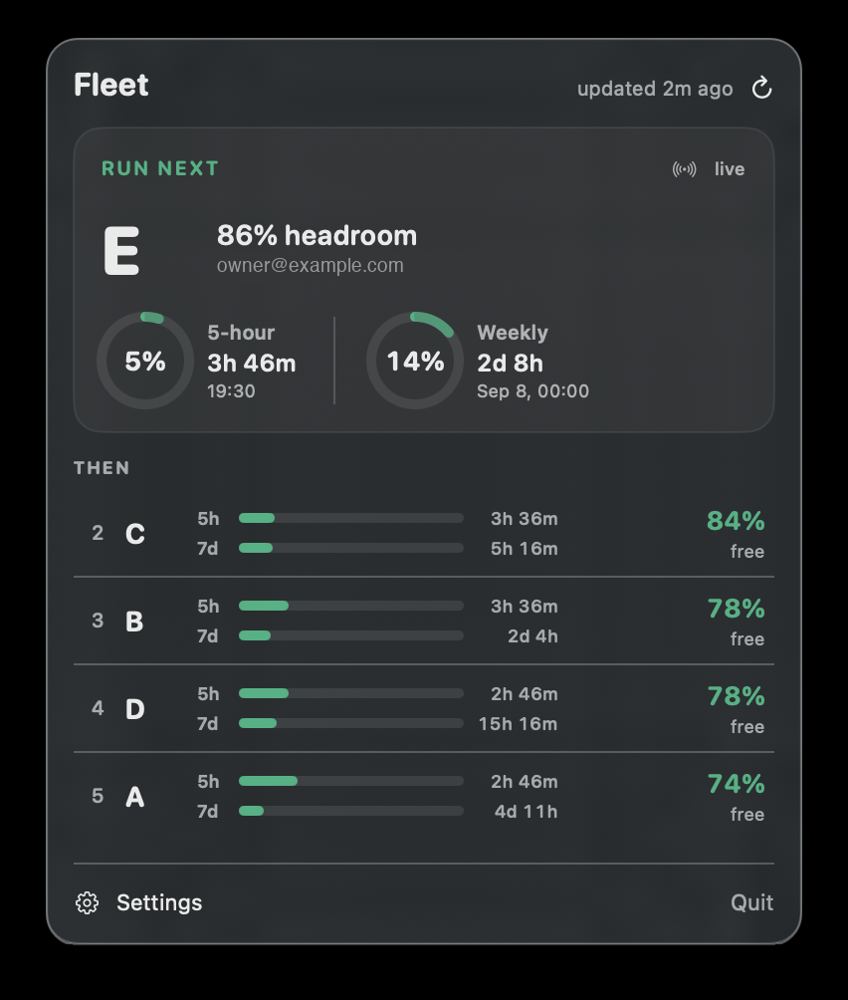

# Claude Fleet Bar

A macOS menu bar app that answers one question for people running **several Claude
Code accounts**: *which one should I run next, and when does the next one free up?*

It auto-detects every `~/.claude-account-*` config dir, reads each account's usage
**live**, and ranks them by real headroom — 5-hour window, weekly window, and the
countdown to each reset.

<p align="center">
  
</p>

> **Why not just read the CLI's cache?** Claude Code stores its last-known usage in
> `<config-dir>/.claude.json` under `cachedUsageUtilization`, but it only writes that
> when the account actually runs a session. On a 5-account fleet, two dirs had numbers
> more than a day stale and two had none at all — one account's cache read 62% weekly
> while the live figure was 10%. A file-only widget quietly tells you the wrong thing,
> so this app fetches live and labels any cached fallback with its age.

## Features

- **Auto-detects accounts.** Anything matching `~/.claude-account-*`, plus `~/.claude`.
  A sixth account works the moment you create it — no config to maintain.
- **Live 5-hour and weekly usage** with utilization rings and reset countdowns.
- **Survives a throttled usage API.** `/api/oauth/usage` rate-limits reads per
  account, and answers `429` with `Retry-After: 0`. A throttled account keeps its
  last live reading — labelled with its age, still ranked, still recommended while
  the reading is under 15 minutes old — and backs off on its own (doubling from
  the refresh interval, capped at 10 minutes) while the other accounts refresh on
  schedule. A 429 is the endpoint saying "not so often", not the account being
  spent, and the board says exactly that.
- **A run order**, not just numbers: headroom is `100 − max(5h, weekly)`, ties break
  toward the lower weekly figure, since a 5-hour window refills in hours and a weekly
  one in days.
- **Transition-only alerts** when an account frees up, is nearly spent, or runs out.
  A notifier that fires every refresh is one you learn to ignore.
- **Click an account to copy its launch command**
  (`CLAUDE_CONFIG_DIR="$HOME/.claude-account-e" claude`), so picking one and using
  it are the same gesture. Right-click for the config dir path or to reveal it in
  Finder. The app never launches Claude itself.
- **Read-only, always.** Credentials are read from the login Keychain and never
  written, refreshed or deleted. An expired token is reported, not repaired.
- **JSON export** to `~/.cache/claude-fleet-bar/usage.json` so scripts can rank
  accounts by measured headroom instead of probing blind. Each row carries its
  `origin` (`live` / `stale` / `cache`), `fetched_at`, `age_seconds`, whether it
  is `actionable`, and `retry_at` when the API is throttling it.
- **Updates itself** via [Sparkle](https://sparkle-project.org), from this repo's
  GitHub Releases. It asks before installing — an update never restarts the app
  mid-task. Each release is EdDSA-signed, and the public key is compiled into the
  app, so a tampered download is refused even if the release host is not.

## Install

Requires macOS 14+ and the Xcode toolchain.

```sh
git clone https://github.com/mehedi1320504/ClaudeFleetBar.git
cd ClaudeFleetBar
./scripts/build-app.sh
open dist/ClaudeFleetBar.app
```

It should not ask for Keychain access at all. Claude Code writes each credential
with `/usr/bin/security`, which stamps the item with an `apple-tool:` partition;
any other app reading it gets the "enter your login keychain password" dialog,
and **Allow** covers a single read. A poller that read five items every two
minutes turned that into a dialog every two minutes. So the app reads with
keychain interaction switched off, and when the keychain would have asked, it
reads through `security` itself, which is inside the partition and is answered
silently. If a row ever says **keychain locked**, click **Grant Keychain access**,
enter your login password once, and choose **Always Allow** — that is the only
dialog the app ever raises, and only when clicked.

> **If that grant does not stick across rebuilds**, that is the ad-hoc signature.
> The login Keychain ties an access grant to the code hash, and an ad-hoc seal
> produces a new one each build — so every rebuild looks like a different app.
> Sign with a Developer ID instead, whose designated requirement is stable
> across builds:
>
> ```sh
> DEVELOPER_ID_APP="Developer ID Application: You (TEAMID)" ./scripts/build-app.sh
> ```
>
> With an Apple Developer account you can also notarize, so Gatekeeper accepts it
> on any Mac:
>
> ```sh
> export DEVELOPER_ID_APP="Developer ID Application: You (TEAMID)"
> export APPLE_ID="you@example.com" APPLE_TEAM_ID="TEAMID"
> export APPLE_APP_PASSWORD="app-specific-password"   # or @keychain:AC_PASSWORD
> ./scripts/notarize.sh
> ```

To start it at login: System Settings → General → Login Items → add
`dist/ClaudeFleetBar.app`.

## Releasing

```sh
export DEVELOPER_ID_APP="Developer ID Application: You (TEAMID)"
export APPLE_ID="you@example.com" APPLE_TEAM_ID="TEAMID"
export APPLE_APP_PASSWORD="app-specific-password"
./scripts/release.sh 1.0.1
```

That builds, notarizes, staples, EdDSA-signs the artifact for Sparkle, updates
`appcast.xml`, tags, publishes the GitHub release, and then checks the download
URL actually resolves — an appcast advertising a missing asset is worse than no
appcast at all.

The Sparkle signing key lives in your login Keychain (put there by
`generate_keys`), never in a file and never in the environment. Losing it means
existing installs can no longer verify updates, so back up the Keychain item.

## CLI

`scripts/fleet-usage` reads the same exported snapshot:

```sh
fleet-usage board   # the full table
fleet-usage best    # just the account to run next, e.g. "b"
fleet-usage order   # "b c e a d"
fleet-usage json    # raw snapshot
```

Handy with a multi-account dispatcher:

```sh
CLAUDE_CONFIG_DIR="$HOME/.claude-account-$(fleet-usage best)" claude
```

## How it works

| Step | Detail |
| --- | --- |
| Discover | Scan `~` for `.claude-account-*` and `.claude` |
| Locate credentials | Claude Code keys its Keychain entry as `Claude Code-credentials-<first 8 hex of sha256(configDir)>`, so each config dir maps to its own item |
| Read token | `SecItemCopyMatching` with keychain interaction disabled → `claudeAiOauth.accessToken`. When the keychain would have prompted (the item's `apple-tool:` partition), `/usr/bin/security find-generic-password -w` reads it instead — same tool that wrote it, so no dialog. Read-only either way |
| Fetch usage | `GET https://api.anthropic.com/api/oauth/usage` with `Authorization: Bearer …` and `anthropic-beta: oauth-2025-04-20` — the same endpoint the CLI uses to fill its own cache |
| Fall back | When a read fails — a 429, a network error, an expired token — keep this app's own last live reading, labelled with its age; with none, show `cachedUsageUtilization` from `.claude.json`, labelled the same way. A window whose reset has passed since the reading is dropped from the ranking: it describes a window that no longer exists |
| Back off | A 429 puts that ONE account on a per-account backoff (one refresh cycle, doubling, capped at 10 minutes; a real `Retry-After` is honoured up to an hour). The manual refresh button ignores the backoff. Alerts never fire on a failed read — a read failure is a change in our view, not in the account |

Accounts are fetched concurrently, so one slow or broken account never holds up the board.

### What it never does

- Write to the Keychain, or touch the CLI's auth state.
- Put a Keychain dialog on screen from a background refresh. The one it raises is
  the **Grant Keychain access** button, when you click it.
- Spend tokens. The usage endpoint is free and read-only — it reports the limits, it
  does not count against them — and this app never sends a message to measure one.
  Five accounts at the default 2-minute interval is 2.5 requests a minute in total.
- Send your data anywhere. The only network call is to `api.anthropic.com`.

## Prior art

This exists because none of the good ones fit a fleet of CLI accounts:

- [dody87/ccam](https://github.com/dody87/ccam) — same data path (Keychain +
  `/api/oauth/usage`) and the source of the key-derivation detail, but CLI only.
- [rjwalters/claude-monitor](https://github.com/rjwalters/claude-monitor) — menu bar
  with a headroom score, but wants tokens pasted by hand and pings `/v1/messages`.
- [f-is-h/usage4claude](https://github.com/f-is-h/usage4claude) — menu bar, but keys
  off browser `sessionKey`s rather than CLI accounts.

## License

MIT — see [LICENSE](LICENSE).

Not affiliated with Anthropic. `/api/oauth/usage` is an internal endpoint and may
change without notice.
